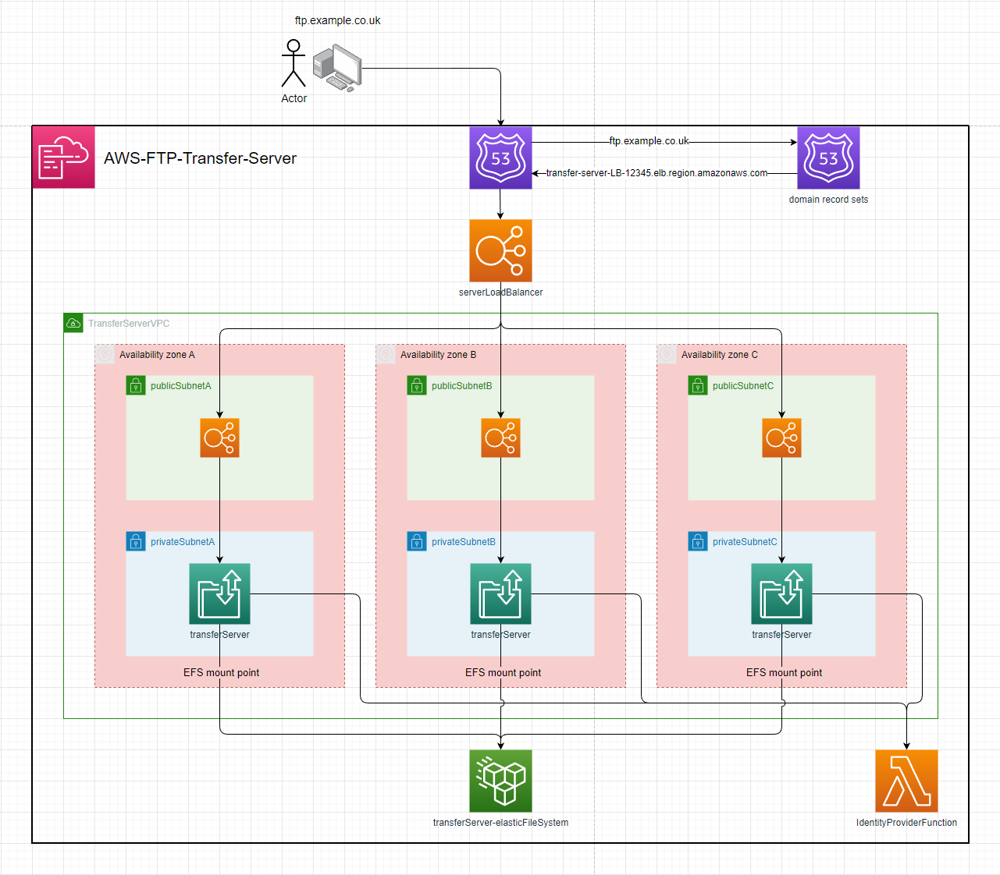
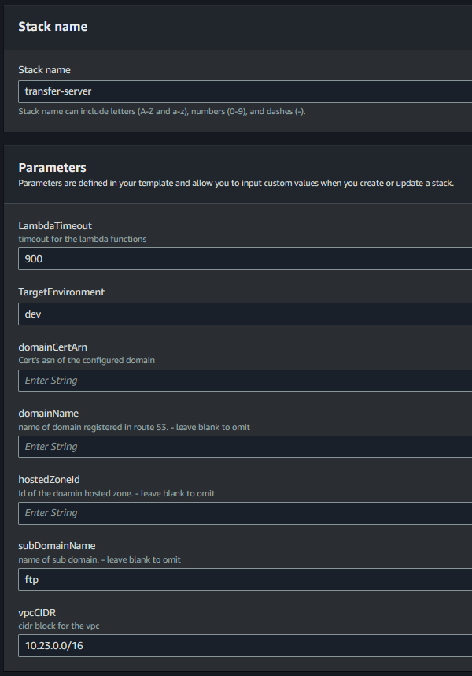
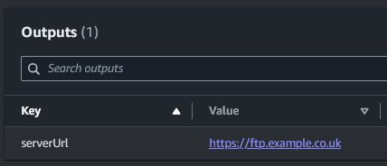
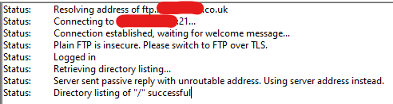
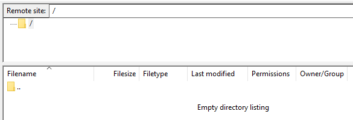

# AWS-Transfer-Server  

  

---

## Setup:  
1. deploy the template to cloudformation  
2. enter the parameters  
  
3. configuration with a domain:  
   1. including the `hostedZoneId`, `domainName` & `domainCertArn` parameters will:  
      1. Setup the `Certificate` on the server & enable `FTPS` as a protocol  
      2. Create a `Route 53 Record` for the `domainName`  
   2. including the `hostedZoneId`, `subDomainName`, `domainName` & `domainCertArn` parameters will:  
      1. Setup the `Certificate` on the server & enable `FTPS` as a protocol  
      2. Create a `Route 53 Record` for the `subDomainName.domainName`  

---

## Usage  
The server's url will be output by the stack  
  
The server can now be connected to over `FTP`, `SFTP` & `FTPS` (if domain is configured)
FileZilla:  
  
  

The Identity provider function will be invoked where the payload can be evaludated & integrated into your environment.  
```json
{
  "username": "user",
  "sourceIp": "10.23.0.6",
  "protocol": "FTP",
  "serverId": "s-0123456789ABCDEF",
  "password": "password"
}
```
